# Azure Medallion Lakehouse Project

# Enterprise Azure Data Lakehouse Platform (Medallion Architecture)

[](#infrastructure-as-code)
[](#data-pipeline-architecture)
[](#processing-engine)
[](#delta-lake-implementation)
[](#serving-layer)

An end-to-end modern data engineering platform deployed on Microsoft Azure using the Medallion Architecture pattern (Bronze → Silver → Gold). 

This platform orchestrates dynamic, metadata-driven data ingestion, implements Change Data Capture (CDC) via Delta Lake `MERGE` operations, enforces enterprise identity governance via Microsoft Entra ID and Azure Key Vault, and serves analytical models through Azure Synapse Serverless SQL without persistent compute costs.

---

## Architecture

```text
[ Data Sources ]
  │ (APIs, RDBMS, Flat Files)
  ▼
[ Azure Data Factory ] ── (Dynamic Parameterized Pipelines via Metadata JSON)
  │
  ▼
[ ADLS Gen2: Bronze Zone ] (Raw Ingestion / Append-Only Parquet)
  │
  ▼
[ Azure Databricks (PySpark) ] ── (Schema Validation, Deduplication, CDC / UPSERTs)
  │
  ▼
[ ADLS Gen2: Silver Zone ] (Cleaned, Conformed Delta Tables)
  │
  ▼
[ Azure Databricks (PySpark) ] ── (Business Aggregates, Z-ORDER Clustering, OPTIMIZE)
  │
  ▼
[ ADLS Gen2: Gold Zone ] (Curated Analytics-Ready Delta Tables)
  │
  ├──► [ Azure Synapse Serverless SQL ] (Logical Views over Delta / Zero Idle Cost)
  │           │
  │           ▼
  └────► [ Power BI Dashboard ] (Direct Lake / Import BI Models)
```

---

## Key Platform Features

* **Metadata-Driven Ingestion:** Eliminates hardcoded ETL pipelines by using ADF `Lookup` and `ForEach` activities governed by JSON manifests, allowing automated onboarding of new datasets.
* **ACID Lakehouse Transactions:** Uses Delta Lake on ADLS Gen2 to support concurrent reads/writes, time-travel audits, and atomic rollbacks.
* **Change Data Capture (CDC):** Handles incremental data loads and late-arriving dimensions using PySpark `MERGE INTO` (SCD Type 1 / UPSERT logic).
* **Storage & Compute Performance Tuning:** Implements file compaction via Delta `OPTIMIZE` and spatial data co-locality via `Z-ORDER` indexing to reduce query scan times by up to 70%.
* **Zero Idle Serving Compute:** Decouples storage from compute by creating Synapse Serverless SQL views directly over Delta files, bypassing the expensive uptime requirements of Synapse Dedicated Pools.
* **Enterprise Identity & Secrets:** Replaces raw storage access keys with Microsoft Entra ID Service Principals (`Storage Blob Data Contributor`) and Databricks Key Vault Secret Scopes.
* **Automated Infrastructure:** Full cloud footprint provisioned reproducibly using Terraform with remote state separation.

---

## Repository Structure

```text
azure-lakehouse-project/
├── .github/
│   └── workflows/              # GitHub Actions CI/CD pipelines
├── adf/                        # Azure Data Factory pipeline definitions & ARM templates
├── config/
│   └── ingestion_list.json     # Metadata configuration driving ADF ingestion
├── databricks/
│   ├── 01_bronze/              # Raw data extraction and staging PySpark notebooks
│   ├── 02_silver/              # Schema validation, cleansing, and CDC merge logic
│   └── 03_gold/                # Star schema dimension/fact modeling and aggregations
├── infrastructure/             # Terraform infrastructure definitions
│   ├── main.tf                 # Core Azure resources (ADLS, Databricks, ADF, Key Vault)
│   └── .gitignore              # Ignores local state files and provider binaries
├── synapse/
│   └── serverless_views.sql    # DDL scripts for logical views over Gold Delta tables
├── .gitignore
└── README.md
```

---

## Data Pipeline Flow

| Stage | Storage Zone | Engine | Format | Description |
| :--- | :--- | :--- | :--- | :--- |
| **Ingestion** | `adls/bronze` | ADF Copy Activity | Parquet / JSON | Dynamic, metadata-parameterized pipeline landing raw data without schema modification. |
| **Cleansing** | `adls/silver` | Databricks (PySpark) | Delta Lake | Explicit schema casting, NULL handling, deduplication, and transactional UPSERTs (`MERGE`). |
| **Curated** | `adls/gold` | Databricks (PySpark) | Delta Lake | Aggregated business metrics, star schema modeling, file compaction (`OPTIMIZE`), and `Z-ORDER` indexing. |
| **Serving** | Analytical Layer | Synapse Serverless SQL | SQL Views | On-demand relational views reading directly from Gold Delta storage files. |

---

## Infrastructure as Code (Terraform)

The cloud infrastructure is defined declaratively using Terraform:

* **Resource Group:** Regional container for lifecycle isolation.
* **ADLS Gen2:** Storage Account configured with `is_hns_enabled = true` and `LRS` redundancy to optimize cost.
* **Containers:** Automated provisioning of `bronze`, `silver`, and `gold` file systems.
* **Azure Key Vault:** RBAC-enabled secrets engine protecting tenant credentials and service principal secrets.
* **Databricks Workspace:** Provisioned under the Premium tier to enable credential passthrough and native Secret Scope integrations.
* **Azure Data Factory:** V2 deployment wired for continuous deployment and Git integration.

---

## Getting Started

### Prerequisites
* [Azure CLI](https://learn.microsoft.com/en-us/cli/azure/install-azure-cli) installed and authenticated (`az login`)
* [Terraform CLI](https://developer.hashicorp.com/terraform/install) (v1.5+)
* Python 3.10+ & PySpark


## 🏗 1. Architecture Overview
Before writing any code, it is critical to understand the data flow. Data moves from the source system, gets orchestrated by Azure Data Factory, processed by Databricks, and stored securely in Azure Data Lake Storage.

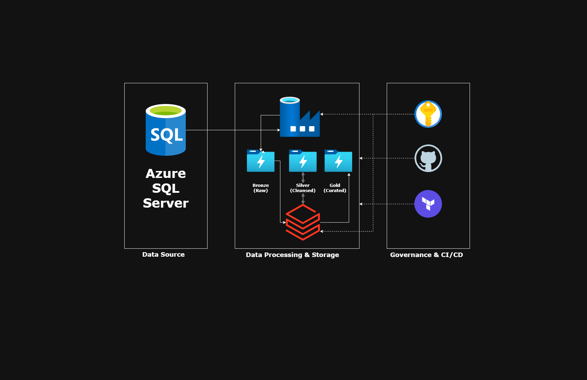

## 🗄️ 2. The Data Source
Every pipeline starts with data. For this project, we extract raw data from an **Azure SQL Database** containing sample relational data (like customers and products).

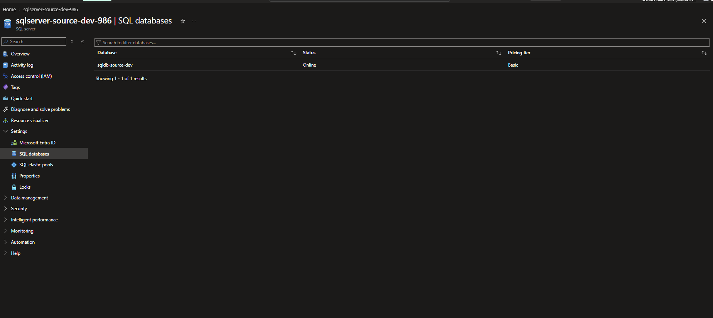

## 🛠️ 3. Infrastructure as Code (Terraform)
Instead of clicking through the Azure portal to create resources manually, we use Terraform to deploy everything automatically. This ensures our environments are identical and error-free.

To prevent two engineers from overwriting changes at the same time, we store a "state lock" file centrally in a dedicated Resource Group and Storage Container.

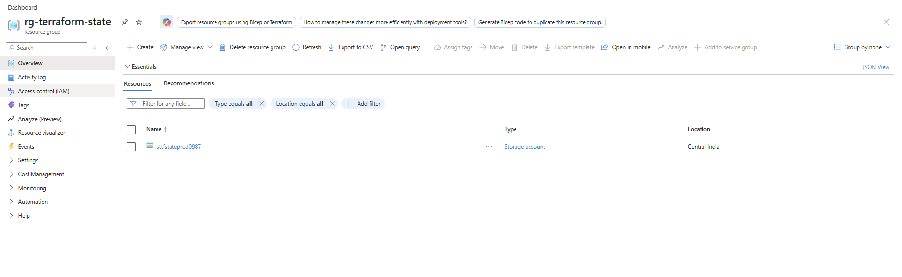
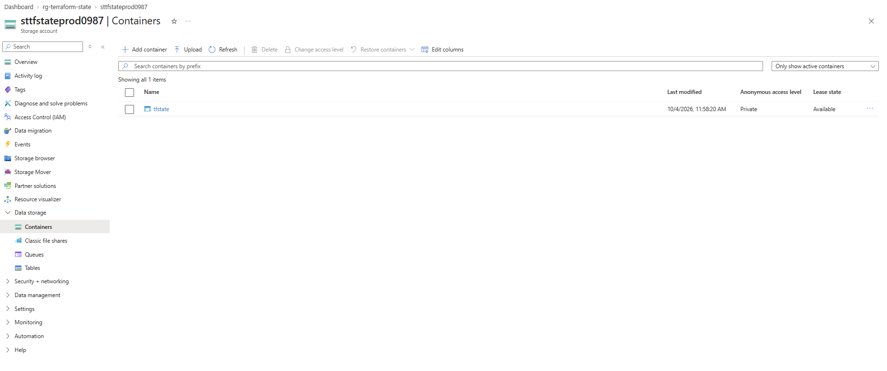

This Terraform code provisions distinct environments, ensuring our Development resources never interfere with our Production resources. 

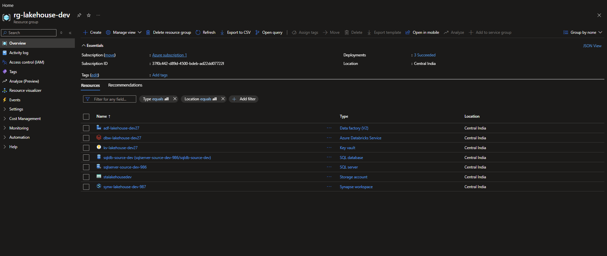
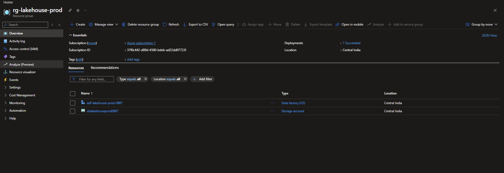

It also provisions a managed resource group dedicated entirely to handling Databricks compute and networking.

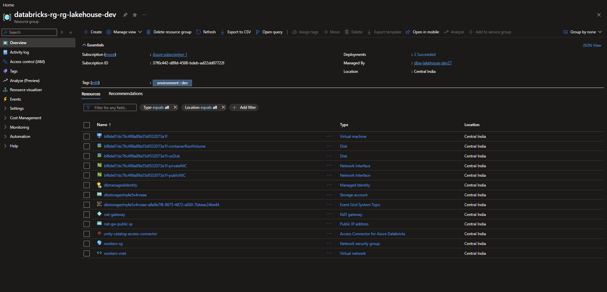

## 🔒 4. Security & Secrets Management
Hardcoding passwords is a major security risk. All database passwords and service principal tokens are securely locked inside **Azure Key Vault**.

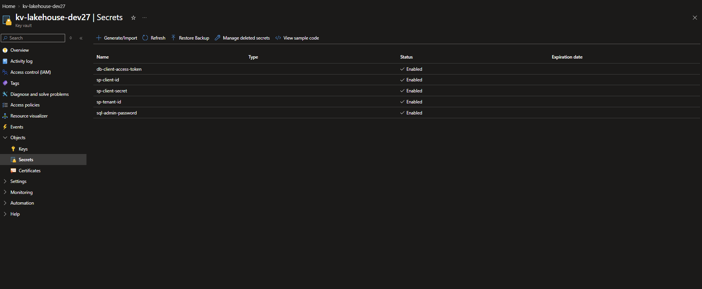

To deploy our infrastructure automatically, we securely store the necessary Azure authentication credentials inside **GitHub Actions Secrets**.

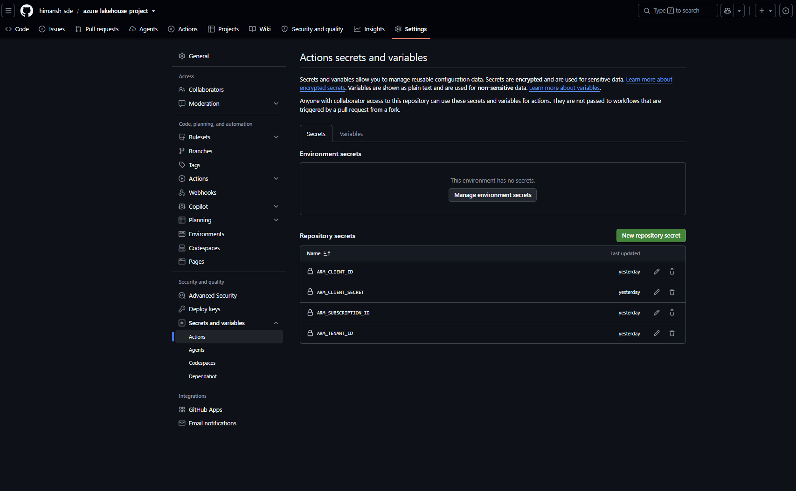

## 🚀 5. Automated CI/CD Deployments
We use GitHub Actions to automate our deployments so human error is eliminated. 

First, our infrastructure pipeline automatically provisions the Azure resources using Terraform.

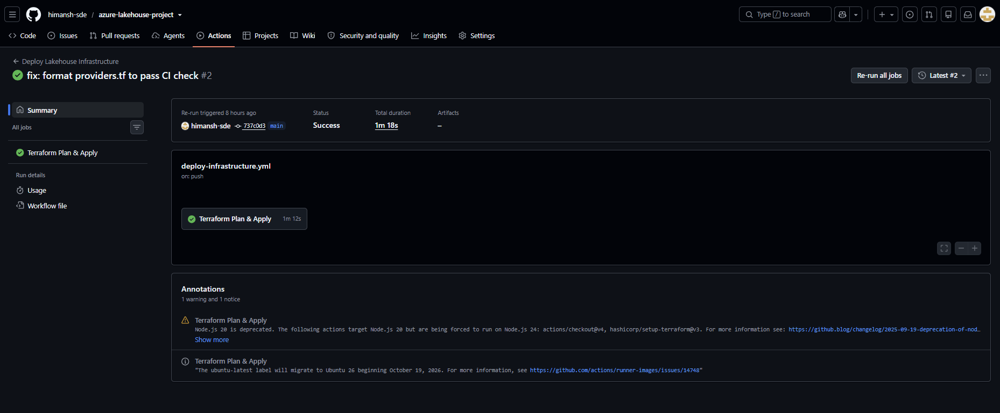

Once the infrastructure is ready, a second pipeline deploys our Azure Data Factory (ADF) orchestration logic directly into the Production environment.

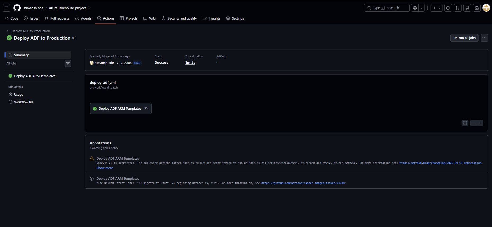

## ⚙️ 6. Data Orchestration
Azure Data Factory is the conductor of our orchestra. This master pipeline loops through our source tables, copies the raw data, and triggers the Databricks notebooks to run the transformations.

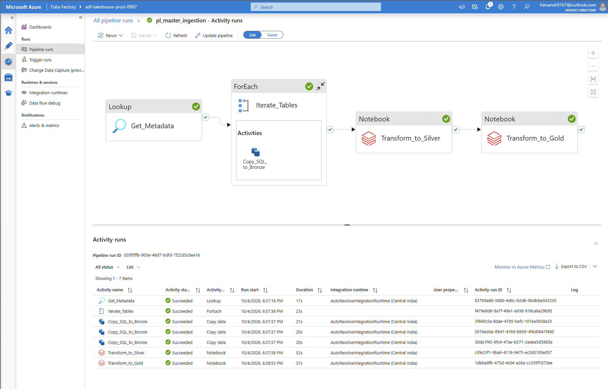

## 📂 7. The Medallion Data Lake
Our Data Lake is neatly organized into distinct containers representing the different stages of data refinement.

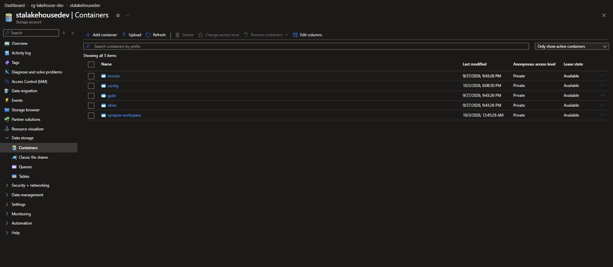

* **Bronze (Raw):** The exact, unchanged data pulled directly from the SQL database.
  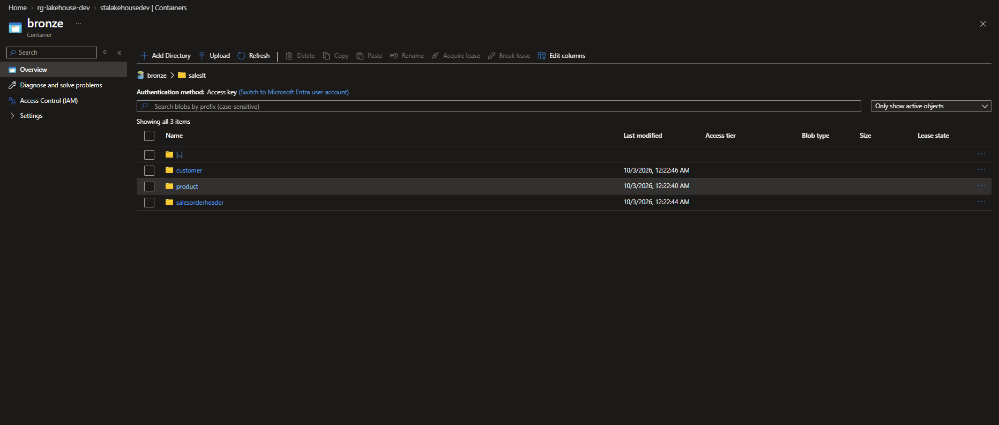

* **Silver (Cleansed):** Data processed by Databricks into Delta Lake format, where duplicates are removed and changes are tracked over time.
  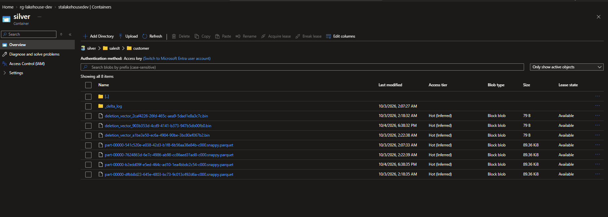

* **Gold (Curated):** Highly optimized, aggregated data ready for business analysts to build dashboards.
  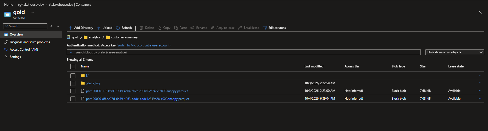

## 📊 8. Data Analytics & Serving
Finally, analysts need to query the Gold data. Instead of building a complex database, we use **Azure Synapse Analytics** serverless SQL pools. This allows users to run standard SQL queries directly against the files sitting in the Data Lake.

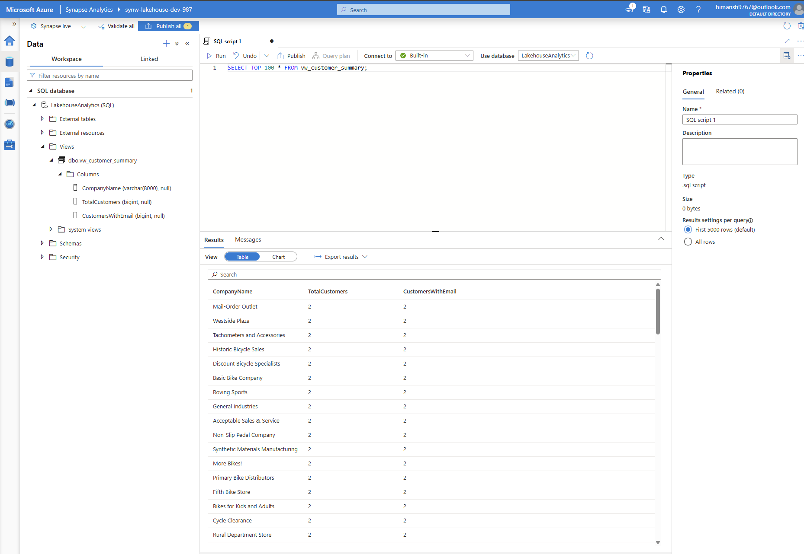

